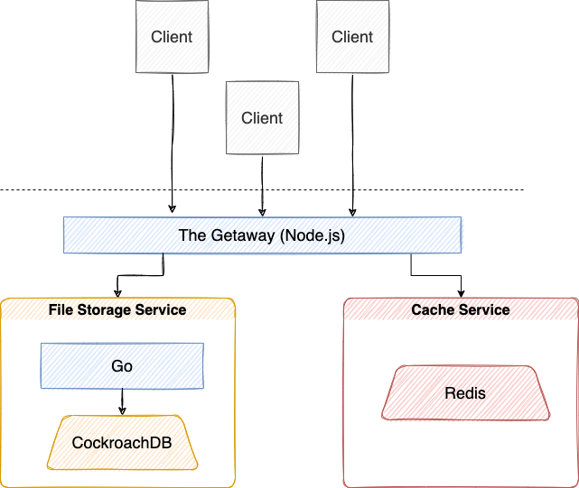

# PAD Course Fall 2021
## Checkpoint 01

### The Services

#### Load Balancer
Implements service discovery. Once we have the addresses of any number of instances of a service we now need a way to decide which node to route to. We use random hashed load balancing to provide even distribution across the services and retry a different node if there's a problem.

#### Public API Service
This service is meant to be a facade for all client requests and request other services in order to formulate response.

#### User Service
This service helps to manage users, their authentication and authorization.

#### Cache Service
This service is used to store for a short period of time some data that is hard to compute like rendered pages or slow SQL queries.

#### File Storage Service
File storage is simple data store interface to read, write and delete records.

### Outbound API Endpoints

* Get access to file: **GET /file/\<uid>**

Response example:
```json
{
  "_id": "507f191e810c19729de860ea",
  "title": "architecture.png",
  "link": "https://srvc.nm/507f191e810c19729de860ea",
  "author": {
    "id": 423,
    ...
  },
  "size": 1024
  ...
}
```
* Uploading new file to server: **POST /file/\<uid>**

Request body will be encoded in _multipart/form-data_

* Request file list on virtual path: **GET /list?path=””**
Response example:
```json
{
  "path": "/photos/feb2020",
  "files": [
    {
      "_id": "507f191e810c19729de860ea",
      "link": "https://srvc.nm/507f191e810c19729de860ea"
    },
    ...
  ]
}
```

* Delete file: **DELETE /file/\<uid>**

* Request one-time URL for uploading new file to server with respective callbacks:
**GET /request/new?success_callback=””&fail_callback=””**;

* Request one-time URL to get access to file by provided path: **GET /request/file?path=””**


### Internal API Endpoints

#### Authorization:
* POST /user
* GET /user
* PUT /user/{userId}
* DELETE /user

#### Cache: 
* POST /cache
* GET /cache
* PUT /cache/{cacheId}
* DELETE /cache

### Used Technologies

NodeJS, Golang, go-micro, Redis, CockroachDB, MongoDB

### Architecture of the System
