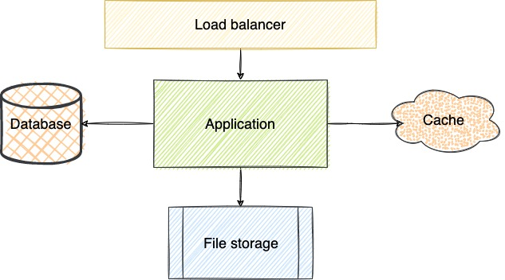

# PAD Course Fall 2021
## Checkpoint 01

### The Services
* Main application
* Load balancer
* Database
* Cache
* File storage
* Side services for Authentication, Mailing etc.

### Outbound API Endpoints

* Get access to file: **GET /file/<uid>**;
* Uploading new file to server: **POST /file/<uid>**;
* Request file list on virtual path: **GET /list?path=””**;
* Delete file(s): **DELETE /file?path=””**;
* Request one-time URL for uploading new file to server with respective callbacks:
**GET /request/new?success_callback=””&fail_callback=””**;
* Request one-time URL to get access to file by provided path: **GET /request/file?path=””**

### Internal API Endpoints

### Used Technologies

### Architecture of the System
