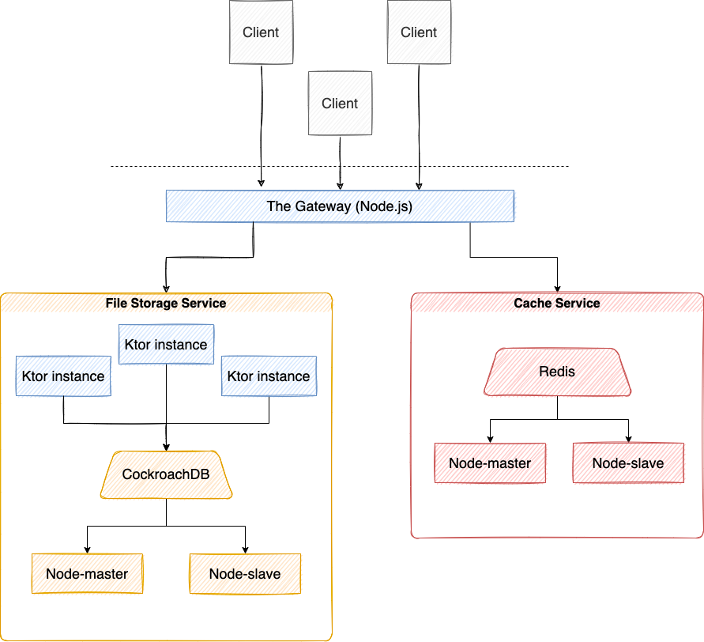

# PAD Course Fall 2021
## Lab 2 Checkpoint 01

### The Gateway
Implements service discovery. Once we have the addresses of any number of instances of a service we now need a way to decide which node to route to. We use round robin load balancing to provide even distribution across the services and retry a different node if there's a problem.
This service is meant to be a facade for all client requests and request other services in order to formulate response.

### The Cache
Cache service is replicated using Redis. We have created master-slave connection between nodes. The Gateway connects to the master node and Redis itself manages data resynchronization and failover.

### The Service
Each service now connects to its own node of the PostgreSQL instance. Database cluster is managed by CockroachDB. It manages clusterization, replication and failover of db nodes.

### Used Technologies

NodeJS - the Gateway;  
KTor - the Services  
Redis - the Cache Service   
CockroachDB - Database Cluster management system  
PostgreSQL - relational database

### Architecture of the System
